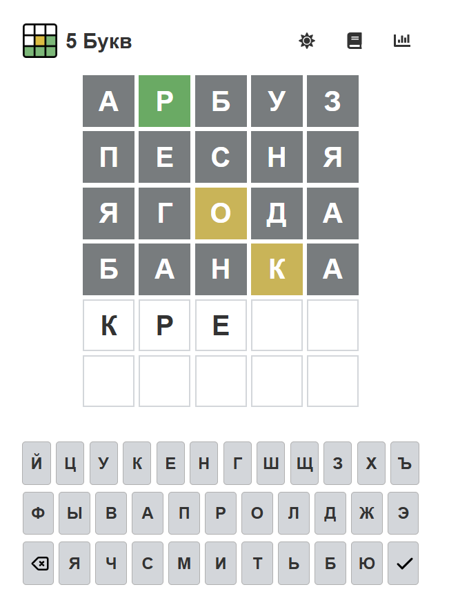

# Wordle Game

This project is a Russian-language Wordle clone built with React and Vite. The game challenges players to guess a 5-letter Russian word in 6 attempts. It features light and dark themes, rules and statistics modals, and local storage to save game state and stats.

## Features

- **Word Guessing**: Players have 6 attempts to guess a 5-letter Russian word.
- **Dynamic Feedback**: After each guess, letters are highlighted to indicate correct positions, presence in the word, or absence.
- **Themes**: Supports light and dark themes with dynamic icons (sun/moon) for switching.
- **Rules and Statistics**: Modals for game rules and player statistics, including wins, losses, and average attempts.
- **Local Storage**: Saves game state and stats using the browser's local storage.
- **Responsive Design**: Optimized for both desktop and mobile devices.

## Technologies Used

- **React**: A JavaScript library for building user interfaces.
- **Vite**: A fast build tool and development server for modern web projects.
- **React Icons**: Used for icons in the header (theme toggle, rules, stats).
- **Sass**: A CSS preprocessor for styling the application.
- **Local Storage**: For persisting game state and statistics.

## Setup and Installation

### Prerequisites

To run this project, you need to have the following installed:

- Node.js
- npm (Node package manager)

### Steps

1. **Clone the repository**:

   ```bash
   git clone https://github.com/samtoroyan22/wordle-game.git
   cd wordle-game
   ```

2. **Install dependencies**:

   ```bash
   npm install
   ```

3. **Run the development server**:

   ```bash
   npm run dev
   ```

4. Open the application in your browser by navigating to `http://localhost:5173`.

## How It Works

1. **App Component**:

   - Manages the game state (secret word, guesses, current guess, theme, stats).
   - Handles theme switching and persists game state in local storage.
   - Renders the main components: `HeaderMenu`, `GameBoard`, `Keyboard`, `Message`, and modals.

2. **HeaderMenu Component**:

   - Displays the game title and logo.
   - Provides buttons for theme switching (sun/moon icons), rules, and statistics using React Icons.

3. **GameBoard Component**:

   - Displays the grid of guessed words and the current guess.
   - Highlights letters based on their status (correct, present, absent).

4. **Keyboard Component**:

   - Renders a virtual keyboard for input.
   - Includes backspace and enter keys with SVG icons that adapt to the theme.

5. **Message Component**:

   - Shows feedback messages (e.g., "Word must be 5 letters!" or "You won!").

6. **StatsModal and RulesModal Components**:
   - `StatsModal` displays player statistics (wins, losses, average attempts).
   - `RulesModal` explains the game rules with examples of letter highlighting.

## Deployment

The project is deployed on GitHub Pages. You can play the game here: [https://samtoroyan22.github.io/wordle-game/](https://samtoroyan22.github.io/wordle-game/)

## Screenshots



## Troubleshooting

- If the game does not load on GitHub Pages, ensure the `base` path in `vite.config.js` is set to `/wordle-game/`.
- If icons or styles are missing, verify that the `homepage` in `package.json` matches the GitHub Pages URL.
- If local storage data is not persisting, check for browser restrictions (e.g., private mode).

## License

This project is licensed under the MIT License.  
Copyright (c) 2025 Samvel Toroyan

# Игра "5 Букв"

Этот проект представляет собой клон игры Wordle на русском языке, построенный с использованием React и Vite. Игрокам предлагается угадать слово из 5 букв за 6 попыток. Игра поддерживает светлую и тёмную темы, модальные окна с правилами и статистикой, а также сохраняет состояние игры и статистику в локальном хранилище браузера.

## Особенности

- **Угадывание слова**: У игрока есть 6 попыток, чтобы угадать слово из 5 русских букв.
- **Динамическая обратная связь**: После каждой попытки буквы подсвечиваются, показывая, находятся ли они на правильном месте, есть ли в слове или отсутствуют.
- **Темы**: Поддерживает светлую и тёмную темы с динамическими иконками (солнце/луна) для переключения.
- **Правила и статистика**: Модальные окна с правилами игры и статистикой игрока, включая победы, поражения и среднее количество попыток.
- **Локальное хранилище**: Сохраняет состояние игры и статистику с помощью локального хранилища браузера.
- **Адаптивный дизайн**: Оптимизировано для десктопных и мобильных устройств.

## Используемые технологии

- **React**: Библиотека JavaScript для создания пользовательских интерфейсов.
- **Vite**: Быстрый инструмент для сборки и разработки современных веб-проектов.
- **React Icons**: Используется для иконок в заголовке (переключение темы, правила, статистика).
- **Sass**: Препроцессор CSS для стилизации приложения.
- **Local Storage**: Для сохранения состояния игры и статистики.

## Установка и настройка

### Требования

Для запуска этого проекта необходимо установить:

- Node.js
- npm (менеджер пакетов для Node.js)

### Шаги

1. **Клонировать репозиторий**:

   ```bash
   git clone https://github.com/samtoroyan22/wordle-game.git
   cd wordle-game
   ```

2. **Установить зависимости**:

   ```bash
   npm install
   ```

3. **Запустить сервер для разработки**:

   ```bash
   npm run dev
   ```

4. Откройте приложение в браузере, перейдя по адресу `http://localhost:5173`.

## Как это работает

1. **Компонент App**:

   - Управляет состоянием игры (загаданное слово, попытки, текущая попытка, тема, статистика).
   - Обрабатывает переключение тем и сохраняет состояние игры в локальном хранилище.
   - Рендерит основные компоненты: `HeaderMenu`, `GameBoard`, `Keyboard`, `Message` и модальные окна.

2. **Компонент HeaderMenu**:

   - Отображает название игры и логотип.
   - Предоставляет кнопки для переключения темы (иконки солнце/луна), правил и статистики с использованием React Icons.

3. **Компонент GameBoard**:

   - Отображает сетку угаданных слов и текущую попытку.
   - Подсвечивает буквы в зависимости от их статуса (правильное место, есть в слове, отсутствует).

4. **Компонент Keyboard**:

   - Рендерит виртуальную клавиатуру для ввода.
   - Включает клавиши Backspace и Enter с SVG-иконками, которые адаптируются под тему.

5. **Компонент Message**:

   - Показывает сообщения обратной связи (например, "Слово должно быть 5 букв!" или "Вы выиграли!").

6. **Компоненты StatsModal и RulesModal**:
   - `StatsModal` отображает статистику игрока (победы, поражения, среднее количество попыток).
   - `RulesModal` объясняет правила игры с примерами подсветки букв.

## Развёртывание

Проект развёрнут на GitHub Pages. Вы можете сыграть в игру здесь: [https://samtoroyan22.github.io/wordle-game/](https://samtoroyan22.github.io/wordle-game/)

## Скриншоты


## Решение проблем

- Если игра не загружается на GitHub Pages, убедитесь, что `base` в `vite.config.js` установлен как `/wordle-game/`.
- Если иконки или стили отсутствуют, проверьте, что `homepage` в `package.json` соответствует URL на GitHub Pages.
- Если данные локального хранилища не сохраняются, проверьте ограничения браузера (например, режим инкогнито).

## Лицензия

Этот проект лицензирован под лицензией MIT.  
Copyright (c) 2025 Samvel Toroyan
